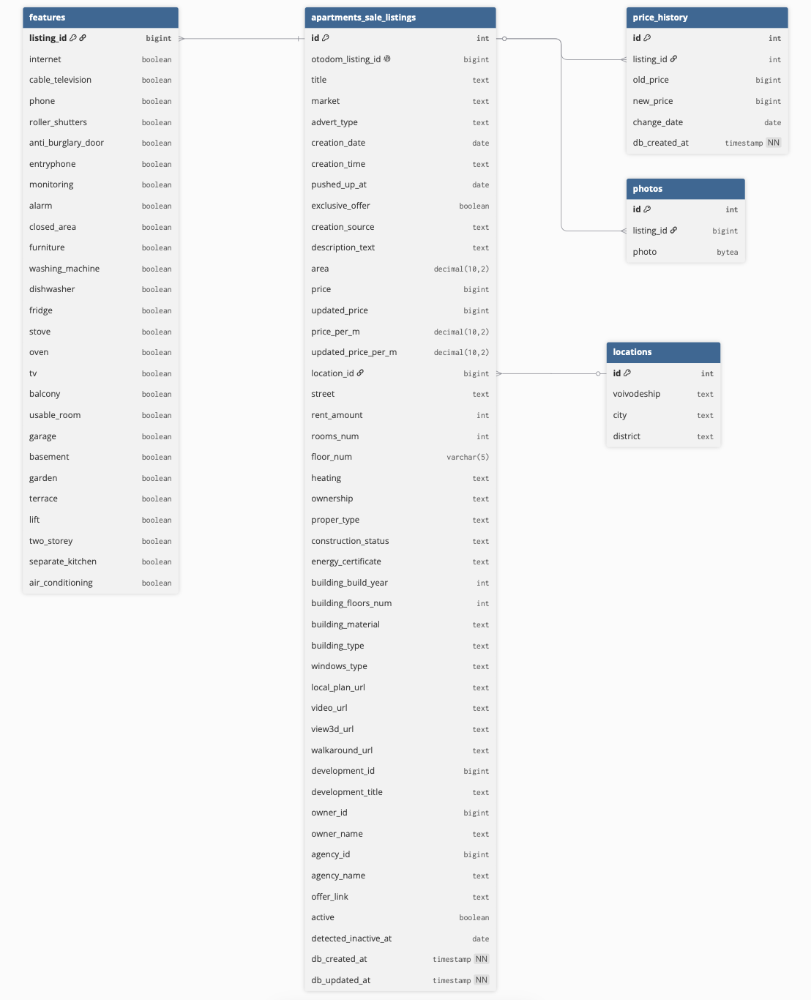

# Apartments for sale - Otodom property scraper & database manager 

## 🏡 About

This project is a web scraping tool designed to automatically collect real estate data from Otodom, a popular property listing platform. The scraper automates the process of extracting property listings and their associated data, which is then stored in a PostgreSQL database for further analysis

The project is currently tailored for scraping only real estate listings related to apartment sales in a specific city

⚠️ **Built only for personal use, for learning and portfolio purposes. I do not recommend using this code for anything other than learning**


## 📦 Database Structure

The database is designed to store apartment listings data, price history, photos, and extracted features. It consists of the following tables:

- `locations` – stores unique location details (city, district, street, etc)
- `apartments_sale_listings` – main table for apartment data
- `price_history` – stores historical price changes
- `photos` – stores binary image data (BYTEA type) related to listings
- `features` – extracted flat features (e.g. air conditioning, balcony, parking, etc)

💡 You can preview the structure in `db/schema.sql`

⚠️ It is designed primarily to work with Katowice listings on Otodom. Therefore, the structure of the locations table assumes expansion to other cities, but still within the Silesian region. The scraper will work for other cities and voivodeships, but the database may not be optimally structured. For future expansion, it is recommended to split the locations table into smaller parts, such as separate tables for voivodeships, cities and/or districts.



## 🚀 Running options
### 1️⃣ Running with Docker (recommended)

The easiest way to run the project is with Docker — no need to install PostgreSQL manually.

**Requirements:** [Docker Desktop](https://www.docker.com/products/docker-desktop) installed and running.

**1. Create your `.env` file** (copy from the example and fill in your password)


**2. Build and run:**

```bash
docker compose up --build
```

This will:
- start a PostgreSQL container (`otodom_db`)
- build the scraper image and run it once
- scraper exits after finishing — no background processes left running

**3. To run the scraper again** (database keeps its data between runs):

```bash
docker compose up
```

**4. To stop and remove containers:**

```bash
docker compose down
```

> 💡 Database data is stored in a Docker volume (`otodom_pgdata`) and persists between runs. To wipe the data completely: `docker compose down -v`


### 2️⃣ Running locally (alternative)

If you prefer to run without Docker, you need **PostgreSQL** installed and a database created:

```bash
psql -U postgres
CREATE DATABASE apartments_for_sale_otodom;
```

Then set up your `.env` with `DB_HOST=localhost` and run:

```bash
python3 -m venv venv
source venv/bin/activate
pip install -r requirements.txt
python3 main.py
```

### 3️⃣ Running with GitHub Actions and Neon

This project can be also run automatically once per day using GitHub Actions.

Required repository secrets:

- `DB_HOST`
- `DB_PORT`
- `DB_NAME`
- `DB_USER`
- `DB_PASSWORD`
- `DB_SSLMODE`

The database should be an external PostgreSQL instance, for example Neon.

The scheduled workflow is defined in:

```text
.github/workflows/daily-scraper.yml
```
It can also be triggered manually from:
```
GitHub → Actions → Daily Otodom Scraper → Run workflow
```
Application logs are uploaded as GitHub Actions artifacts after each run.

## 🔑 Environment Variables

All configuration is done via `.env` file in the project root. See `.env.example` for the required variables.

> 💡 When running for the first time, the necessary tables will be automatically created if they don't already exist.


## 🧪 Tests

The project has a unit test suite covering the repository and normalization layers. Tests use `pytest` and mock the database connection — no real DB needed to run them.

```bash
source venv/bin/activate
pytest tests/
```

> 🚧 Planned: remaining unit and integration tests for the scraping and service layers.
>
> 🚧 Planned: contract tests for the scraping layer — to detect if Otodom changes their page structure (missing fields, changed JSON keys, etc.), the kind of breakage that currently only surfaces at runtime.

## 📝 Logging

Database operations are logged using Python's logging module. Logs are saved to the logs/ directory and can be adjusted via `config/logging_config.py`. If you are using option 3 with GitHub Actions the logs are stored as GitHub Actions artifacts after each run.


